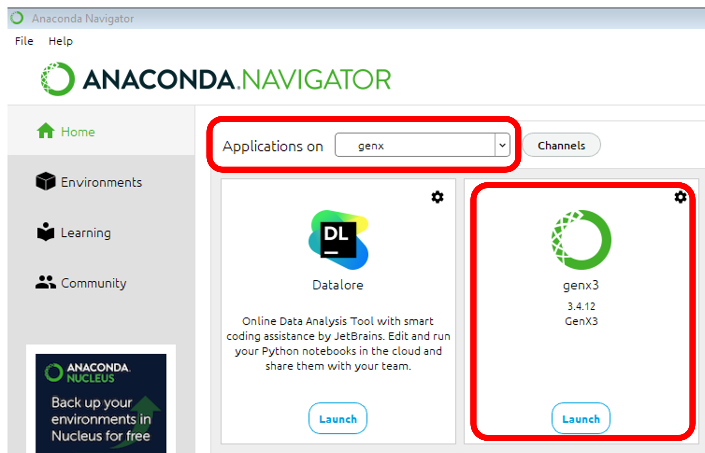

This is a draft for a recipe to build a conda package of [genx3](https://aglavic.github.io/genx/) by A. Glavic.

Since we were facing difficulties with the installation of the genx package for windows, mainly regarding the dependencies, 
this is the attempt to provide a operation system independent conda package with pure conda dependencies that can be installed
in a fresh conda environment with a single line command. Further this package integrates as app in the [Anaconda Navigator](https://docs.anaconda.com/anaconda/navigator/index.html).

# Prerequisite
We assume a running `miniconda` or `anaconda` installation ([if needed, see this guide](https://docs.conda.io/projects/conda/en/latest/user-guide/install/index.html)).
A miniconda installation is sufficient, however, in this case the _Anaconda Navigator_ needs to be installed separately by running

```
conda install anaconda-navigator
```

in the terminal or (_Anaconda Powershell_ on Windows).

# Installation

To use this package in a fresh conda environment just run

```
conda create --name genx genx3 -c https://schreiber-lab.github.io/genx-conda-draft -c conda-forge
```

of cause the name of the _conda environment_ can be chosen differently (in example above: `genx`).

Alternatively, the package can be installed in an existing environment via

```
conda install genx3 -c https://schreiber-lab.github.io/genx-conda-draft
```

however, in this case one has to take care about conda-forge and a supported python version beforehand.

# Usage

## Start through Anaconda Navigator

just click on the `Launch` button of the _genx_-app in the _Anaconda Navigator_. Go get there, make sure you have selected to correct environment (`genx`) in the  _Anaconda Navigator_.



## Start from the command line 

### on Linux

```
conda activate genx
```
to activate the proper _conda environment_  and

```
genx
```
to start genx.

### on Windows

on Windows it is recommended to use the _Anaconda Powershell_ for the following steps.

```
conda activate genx
```
to activate the proper _conda environment_  and

```
genx_run
```
to start genx.

### on MacOS

not yet tested!
